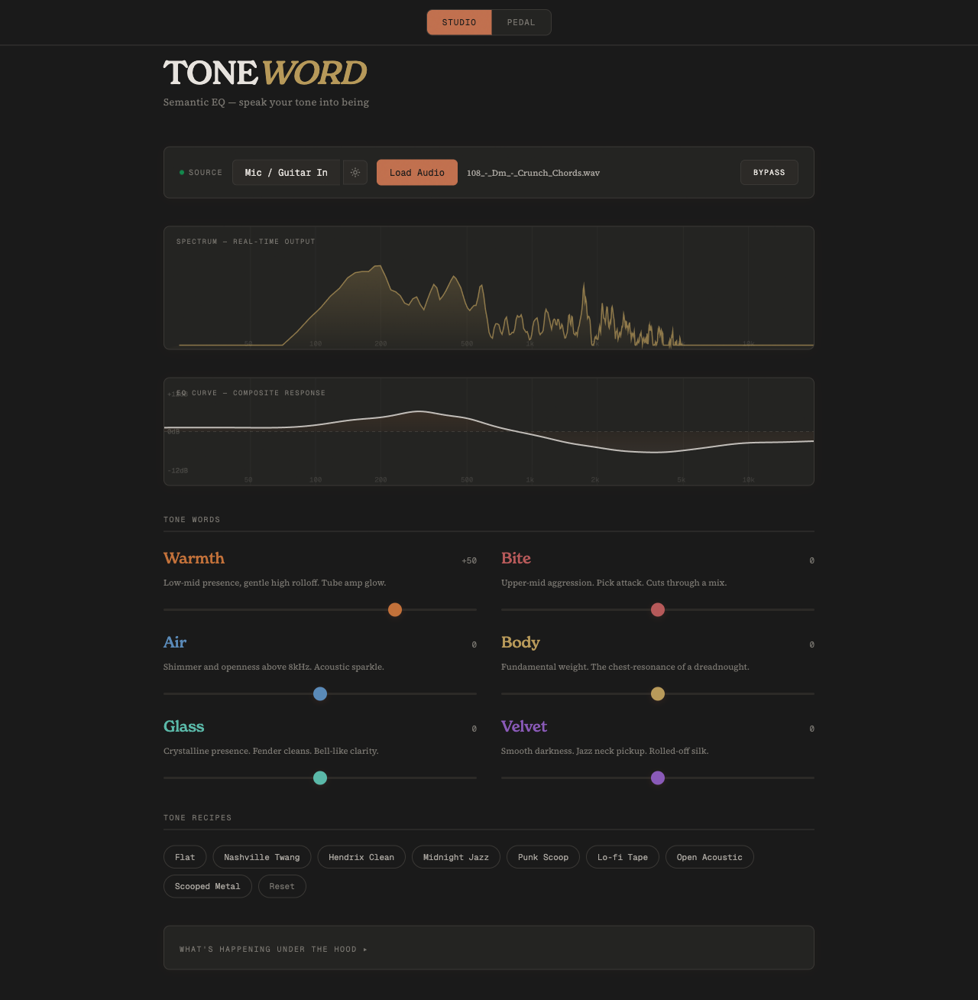

# TONEWORD

**Semantic EQ — speak your tone into being.**

> **[Try it live](https://manzanita-research.github.io/toneword/)** — plug in a guitar or load a file, no install needed.

TONEWORD replaces frequency/gain/Q knobs with perceptual tone words: **Warmth**, **Bite**, **Air**, **Body**, **Glass**, **Velvet**. Each word maps to a complex multi-band EQ curve under the hood, so you shape tone the way guitarists actually think about it — not the way audio engineers parameterize it.

## Why this exists

EQ interfaces are stuck in the audio engineering paradigm. Tools like Pro-Q give you surgical precision across thousands of frequency points, but they train you to EQ with your eyes instead of your ears. TONEWORD goes the other direction: describe what you want to hear, and build frequency intuition over time as the teaching panel reveals what's actually happening.

## What it does

- **Six semantic dimensions** mapped to an 11-band parametric EQ engine
- **Bipolar controls** (-100 to +100) — negative Warmth is "cold/thin," negative Bite is "smooth/recessed"
- **Cross-coupled gain mappings** — boosting Glass automatically cuts Velvet frequencies, mirroring perceptual opposition
- **Soft-clipping via `tanh`** prevents extreme gains when stacking dimensions
- **Tone Recipes** — preset combinations (Nashville Twang, Midnight Jazz, Punk Scoop, etc.)
- **Teaching panel** — shows the EQ curve and per-band gains so you learn what "Warmth" actually means in frequency space

## Web app

The [live web app](https://manzanita-research.github.io/toneword/) runs entirely in your browser using the Web Audio API. Plug in a mic or guitar, or load an audio file. Studio mode gives you sliders and visualizations; pedal mode gives you a stompbox interface with rotary knobs.

Source is in `web/`.

## Plugin

TONEWORD is also a JUCE audio plugin (VST3, AU, Standalone) built on the [pamplejuce](https://github.com/sudara/pamplejuce) template. Same DSP engine, native in your DAW.

Formats: **VST3** / **AU** / **Standalone**
Platform: **macOS 12+** (Universal Binary — Apple Silicon + Intel)

See [DEVELOPMENT.md](DEVELOPMENT.md) for build instructions.

## Status

v1.0. The plugin builds, passes pluginval (strictness 10) and auval validation, and has CI via GitHub Actions. The web app is live. GUI has studio mode with sliders, spectrum analyzer, EQ curve, and a teaching panel that breaks down per-band contributions.

## Roadmap

1. ~~JUCE plugin + web app~~ — shipped
2. **Physical stompbox** — Electro-Smith Daisy Seed platform, OLED + 6 encoders
3. **Broader ecosystem** — more "ears over eyes" tools for guitarists and producers
